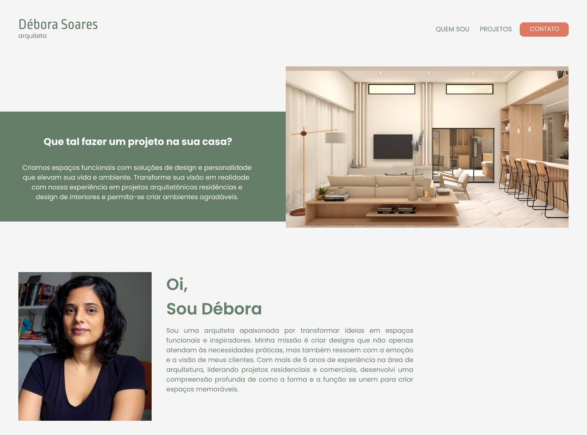

<h1 align="center"> Débora Soares  Arquiteta</h1>

Criamos espaços funcionais com soluções de design e personalidade que elevam sua vida e ambiente. Transforme sua visão em realidade com nossa experiência em projetos arquitetônicos residências e design de interiores e permita-se criar ambientes agradavéis.

 

  

## 🚀 Tecnologias

Esse projeto foi desenvolvido com as seguintes tecnologias:

- HTML e CSS
- JavaScript
- Git e Github
- Figma

## 💻 Projeto

Cartão de visitas online.

## 🔖 Layout

Você pode visualizar o layout do projeto através [DESSE LINK](https://www.figma.com/file/J0UFC1tEHGhUok7cIOc8sw/Landing-page-D%C3%A9bora?type=design&t=9enflA8cvDZu3SmF-6). É necessário ter conta no [Figma](https://figma.com) para acessá-lo.

Feito com ♥ by Débora Soares 